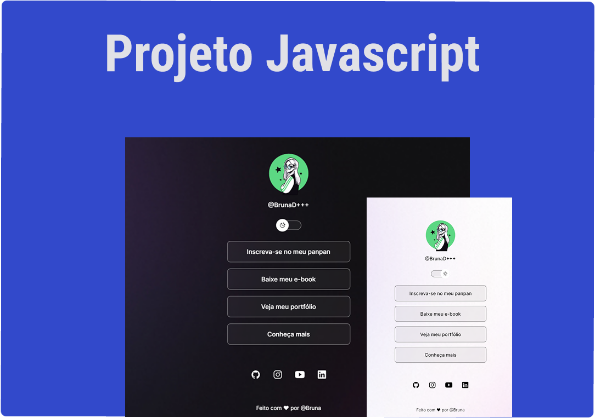

<h1 align="center"> Project Script Initial </h1>

Exclusivo e gratuito, feito por Bruna para demonstração de técnicas de tecnologias WEB.

  <a href="#-tecnologias">Tecnologias</a>&nbsp;&nbsp;&nbsp;|&nbsp;&nbsp;&nbsp;
  <a href="#-projeto">Projeto</a>&nbsp;&nbsp;&nbsp;|&nbsp;&nbsp;&nbsp;
  <a href="#-layout">Layout</a>&nbsp;&nbsp;&nbsp;|&nbsp;&nbsp;&nbsp;
  <a href="#memo-licença">Licença</a>

  

## 🚀 Tecnologias

Esse projeto foi desenvolvido com as seguintes tecnologias:

- HTML e CSS
- JavaScript
- Git e Github
- Figma

## 💻 Projeto

HTML e CSS -> avançado  
Javascript com estudos da teoria da programação e outras lógicas aplicadas.

## 🔖 Layout

## Licença

Esse projeto está sob a licença MIT.

<footer>Feito com ♥ por @Bruna pode usar a vontade ♥ ♥ ♥ </footer>
